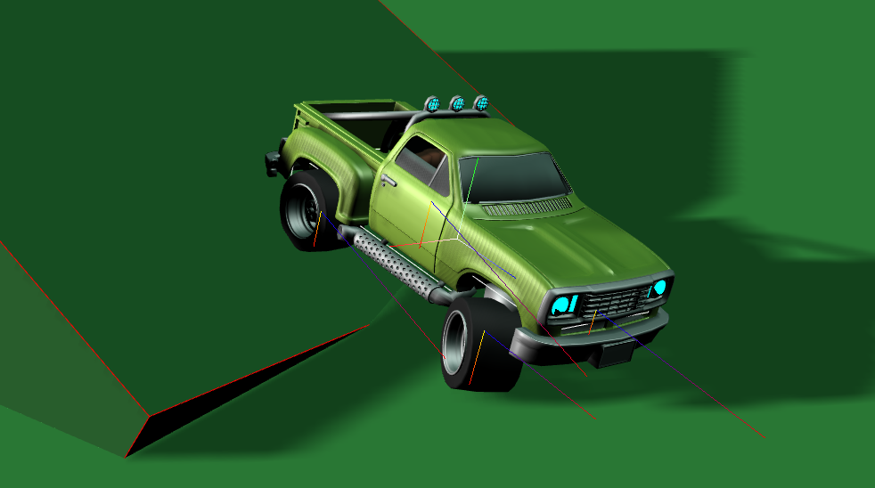
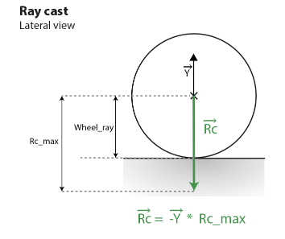
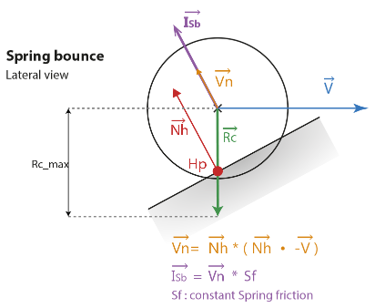
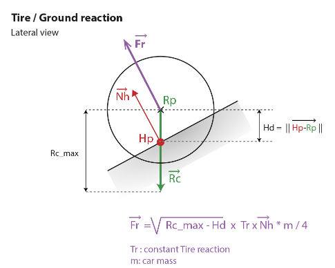
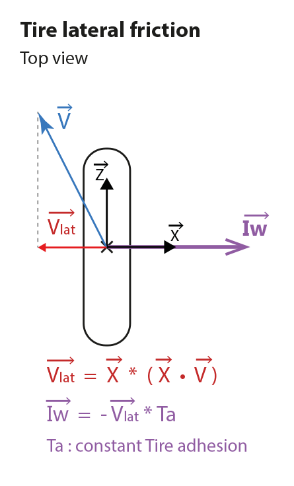
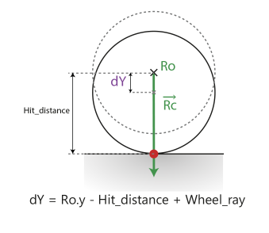
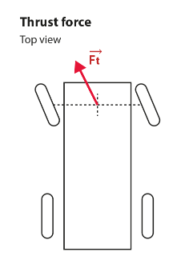

# HARFANG® 3D

## Raycast Car

Modèle 3D réalisé par **Christophe Desse**, avec son aimable autorisation.

## Sommaire

1. Description du modèle
2. Architecture du code
3. Conversion FBX vers HARFANG
4. Chargement des meshes
5. Mise en pratique du modèle
6. Conclusion

----

## 1 - Description du modèle

La physique d'un véhicule à 4 roues peut être très complexe, selon le niveau de réalisme souhaité de la simulation.  
Le modèle abordé ici est plutôt destiné aux rendus en temps réel (jeux vidéo, simulateurs grand public), donc une physique simplifiée, qui ne demande pas de grandes ressources CPU.  
La cinétique sera prise en charge par le moteur physique Bullet. Nous nous contenterons de calculer les forces et impulsions exercées sur le véhicule. Ce n'est déjà pas si mal.

#### Force et impulsion

Une force provoque une variation de la vitesse au cours du temps: F = m*a = m * (Vf-Vi)/t  
Une impulsion est une variation de la quantité de mouvement en un temps donné: I = m * (Vf-Vi)

Pour en savoir plus sur la différence entre force et impulsion, vous pouvez consulter entre autres [cet article](https://fr.wikipedia.org/wiki/Force_(physique)) (force) et [celui-ci](http://profs.cmaisonneuve.qc.ca/svezina/nya/note_nya/NYA_XXI_Chap%203.12.pdf) (impulsion).

Voici la liste des forces et impulsions qui agissent sur notre modèle:

 * Isb : Impulsion des amortisseurs
 * Fr : Réaction des pneus sur le sol
 * Iw : Impulsion latérale des pneus sur le sol (adhérence)
 * Ft : Traction du moteur (déplacement du véhicule)

#### Le raycast

Un raycast est lancé à chaque roue.

L'origine du rayon est fixe par rapport au châssis, et sa position correspond à la position moyenne de la roue.  
La portée du rayon correspond à la position la plus basse du contact entre le pneu et le sol.  
Le rayon est orienté dans le sens inverse de l'axe Y du châssis.

#### Le rebond de l'amortisseur

Le rebond est calculé en fonction de la projection du vecteur vitesse **V** sur la normale du sol **Nh**.  
La constante **Sf** permet de paramétrer la force des amortisseurs.

#### La réaction des pneus sur le sol

Les pneus agissent comme un ressort. A leur point d'équilibre, leur force de réaction contrebalance la force exercée par la gravité.  
Sur le schéma, la masse du véhicule est divisée par 4, car nous considérerons qu'elle est constamment répartie sur les 4 roues.
La constante Tr est le paramètre qui nous permet de régler la force de réaction des pneus.

#### La friction latérale des pneus sur le sol

Cette impulsion est importante, elle conditionne la stabilité du véhicule.

Le paramètre Ta détermine l'adhérence du pneu.
La friction latérale n'est appliquée que si la roue touche le sol.

#### Positionnement du pneu sur le sol

Pour plaquer le pneu au sol, nous allons user d'un subterfuge: un simple repositionnement sur Y.

Ro: origine du raycast dans le repère local du véhicule.  
dY: le déplacement de la roue dans le repère local.

Dans la réalité, c'est l'amortisseur qui ramène la roue au sol. Ce qui implique une accélération verticale de la roue par rapport au châssis.  
Ici, nous n'avons pas besoin d'un tel degré de réalisme.  
*A noter que le point d'origine Ro du raycast ne se déplace pas par rapport au châssis.*

#### Déplacement

Le déplacement d'un véhicule, dans la réalité, est du à l'action des roues motrices sur le sol. Pour simplifier, nous appliquerons une force au milieu de l'essieu moteur, aligné sur la direction des roues.

Cette force sera conditionnée par le contact des roues motrice au sol:
Si une seule roue est en contact, la force est réduite à moitié, et elle est nulle si aucune des roues ne touche le sol.

Pour le freinage, nous appliquerons une force orientée dans le sens inverse de la vitesse du véhicule, conditionnée par le contact des roues avec le sol.

-----

## 2 - Architecture du code

Nous allons créer une classe `Car` pour la voiture, décrite ci-après. Vous trouverez d'autres éléments dans le programme joint à ce tutoriel: une caméra de poursuite (camera follow), et la gestion des inputs pour pouvoir contrôler le véhicule.  
Nous ne nous attarderons pas sur ces parties du code; elles sont là essentiellement pour pouvoir tester notre véhicule.

-----

## 3 - Conversion FBX vers HARFANG

HARFANG3D utilise un format propre pour charger les meshes et les scènes 3D. Le convertisseur **FBX Converter** permet d'importer les modèles depuis le format FBX.  
Il fonctionne en ligne de commande:  
	
	fbx-convert <input> [-o <output_dir>] 

Des options sont possibles pour affiner la conversion. Vous trouverez la documentation complète sur le site de [HARFANG](https://www.harfang3d.com/doc/0.9.6/man.FbxImporter.html).

Nous avons joint le script `convert_fbx_assets.bat` à ce tutoriel, ainsi que la scène contenant le véhicule au format FBX à titre d'exemple.

-----

## 3 - Chargement des meshes

Avant de charger les meshes, il faut créer un objet Scene, avec une caméra et de l'éclairage.  
Nous n'entrons pas dans les détails de cette phase d'initialisations, vous pouvez parcourir le code joint à ce tutoriel pour approfondir.

	[...]
	scene = plus.NewScene()
	camera = plus.AddCamera(scene)
	camera.SetName("Camera")
	init_lights(plus, scene)

Puis on charge le modèle du véhicule. Avant de récupérer les données, il est préférable de s'assurer que la scène est prête.

	[...]
	plus.LoadScene(scene, "assets/car_big_wheeler/car_big_wheeler.scn")
    while not scene.IsReady():						# Wait until scene is ready
        plus.UpdateScene(scene, plus.UpdateClock())
		 
#### Scènes multiples:
Au sein d'une application, vous pouvez avoir besoin de séparer les meshes dans différents fichiers.  
Par exemple, si dans un simulateur vous avez plusieurs scènes, inutile d'y inclure le véhicule dans chacune d'elles. En effet, vous pouvez charger plusieurs meshes sur un même objet Scene.   

#### Référencement des nodes:

Le meshe contient les éléments suivants:
 
 * Châssis
 * Moteur
 * Boîtes de collision
 * Roues
 
Toutes ces nodes sont liées par une hiérarchie: le moteur, les roues et les boîtes de collision sont des "enfants" du châssis.

Les nodes sont référencées dans le constructeur de la classe `Car`:

	class Car:
		def __init__(self, name, plus, scene, start_position: hg.Vector3, start_rotation=hg.Vector3.Zero):
			self.name = name
			self.chassis_node = scene.GetNode("car_body")
			self.thrust = scene.GetNode("thrust")
			self.wheels = self.get_wheels(plus, scene)
			self.chassis_rigid, self.collisions_boxes = self.get_collisions(scene)

##### Le châssis et le moteur:
Les nodes correspondantes au châssis et au moteur sont récupérées grâce à un simple `Scene.GetNode()`.

##### Les roues:
Les roues sont stockées dans une liste:

	def get_wheels(self, plus, scene):
		wheels = []
		for n in range(4):
			wheel = scene.GetNode("wheel_" + str(n))
			wheels.append(wheel)
		return wheels

 
##### Boîtes de collision:

Ce sont des pavés qu'il faut transformer en objets `BoxCollision`.
Les nodes portent toutes le même nom "col_shape".

Dans un premier temps, nous récupérons leurs dimensions et leurs positions, que nous réattribuons aux objets `BoxCollision`.  
*Attention: le pivot d'une boîte de collision est toujours situé à son centre géométrique, ce qui n'est pas le cas des pavés que nous récupérons dans le meshe. Il faut en tenir compte lors du positionnement de la `BoxCollision`.*

Ensuite, les nodes sont supprimées de la scène.

Enfin, pour que ces boîtes de collision soient prises en compte par le moteur physique de HARFANG, il faut créer un objet `RigidBody`, et ajouter tout ces composants au node du châssis.

	def get_collisions(self, scene):
		rigid = hg.RigidBody()
		rigid.SetType(hg.RigidBodyDynamic)
		self.chassis_node.AddComponent(rigid)
		collisions_nodes = scene.GetNodes("col_shape")
		collisions_boxes = []
		for col_shape in collisions_nodes:
			colbox = hg.BoxCollision()
			collisions_boxes.append(colbox)
			obj = col_shape.GetObject()
			bounds = obj.GetLocalMinMax()
			dimensions = bounds.mx - bounds.mn
			pos = col_shape.GetTransform().GetPosition() + bounds.mn + dimensions * 0.5
			colbox.SetDimensions(dimensions)
			colbox.SetMatrix(hg.Matrix4.TranslationMatrix(pos))
			self.chassis_node.AddComponent(colbox)
			scene.RemoveNode(col_shape)
		return rigid, collisions_boxes

----

## 5 - Mise en pratique du modèle
		
Dans le chapitre 1, nous avons décrit le modèle théorique. Penchons nous maintenant sur le code.
		
#### Initialisations:

##### Raycasts:

Une grande partie de la mécanique du véhicule repose sur les raycasts qui vont nous permettre de connaître la position et la pente du sol sous chaque roue. Pour lancer ce rayon, on utilise la fonction suivante:

		hit,impact = scene.GetPhysicSystem().Raycast(ray_position,ray_direction,layer_mask,max_distance)

Cette fonction renvoie un flag("hit") et un objet `PhysicTrace`, qui contient la node impactée, la position du point d'impact et la normale du polygone touché.  
Si le rayon n'a rien touché, le flag "hit" est mis à False.

Le paramètre `layer_mask` sert dans le cas de systèmes nécessitant de distinguer les collisions. Ce n'est pas le cas ici, nous activerons 8 bits du masque (0x255 en hexadécial).

Les positions de départ des rayons `ray_position` correspondent aux positions initiales des roues.    
Dans le constructeur de la classe `Car`, on appelle la fonction `get_rays()`, qui mémorise les positions initiales des roues dans le repère local du châssis.

	self.local_rays = self.get_rays()

Et la fonction:

	def get_rays(self):
		rays = []
		for wheel in self.wheels:
			rays.append(wheel.GetTransform().GetPosition())
		return rays		

La direction des rayons `ray_direction` correspond à l'inverse de l'axe Y du châssis. Elle est mise à jour à chaque frame. On ne s'en occupe donc pas dans la phase d'initialisation.

Quant à la distance balayée par le rayon `max_distance`, on peut la calculer à partir du rayon des roues, en ajoutant le battement bas maximum que l'on souhaite pour les amortisseurs.

	[...]
	self.wheels_ray = self.wheels[0].GetObject().GetLocalMinMax().mx.y
	self.ray_max_dist = self.wheels_ray + 0.2

##### Masse:

Chaque `CollisionBox` a sa propre masse, que l'on défini grâce à la fonction `Collision.SetMass()`. Pour ajouter un peu de réalisme, à partir de la masse totale du véhicule, nous pouvons calculer la masse de chaque boîte de collision en fonction de son volume.  

	def set_mass(self, mass):
		volumes = []
		total_volume = 0
		for colbox in self.collisions_boxes:
			dimensions = colbox.GetDimensions()
			volume = dimensions.x * dimensions.y * dimensions.z
			total_volume += volume
			volumes.append(volume)
		self.density = mass / total_volume / 1000
		for i in range(len(self.collisions_boxes)):
			self.collisions_boxes[i].SetMass(volumes[i] / total_volume * mass)
		self.mass = mass

##### Réglages du véhicule:

Dans le modèle théorique, nous avons défini plusieurs constantes: impulsion des amortisseurs, réaction et adhésion des pneus.  
Nous pouvons ajouter deux autres paramètres, propres au moteur physique Bullet: le *damping* agulaire et linéaire, qui permettent de régler de manière plus fine la stabilité du véhicule. On peut comparer le damping aux forces de frottement.

	def setup(self, mass=1500, spring_friction=0.5, tires_reaction=26, tires_adhesion=0.025, linear_damping=0.1, angular_damping=0.1):
		self.chassis_rigid.SetAngularDamping(linear_damping)
		self.chassis_rigid.SetLinearDamping(angular_damping)
		self.spring_friction = spring_friction
		self.tires_reaction = tires_reaction
		self.tires_adhesion = tires_adhesion
		self.set_mass(mass)

Notre voiture est prête à prendre la route.
		
#### Calculs des forces et impulsions:

A chaque frame de rendu, nous appelons la fonction `Car.update_kinetic()`.

La fonction `Rigid.SetIsSleeping(False)` est exécutée systématiquement. En effet, lorsqu'un `RigidBody` est immobile, Bullet le place automatiquement en 'veille'. Il n'y a alors plus moyen de déplacer notre objet.  
Ensuite, la direction des raycasts est calculée dans le repère absolu (World).  
Enfin, les forces agissants aux niveau des roues sont mises à jour.

	def update_kinetic(self, scene, dts):
		self.chassis_rigid.SetIsSleeping(False)
		self.ray_dir = self.chassis_node.GetTransform().GetWorld().GetY().Reversed()
		for i in range(4):
			self.update_wheel_physic(i, dts)

La fonction `Car.update_wheel_physic()`est appelée pour chaque roue.			
Dans un premier temps, le vecteur utilisé pour le raycast est calculé dans le repère absolu (World).  
Si la roue touche le sol, les forces et impulsions décrites au chapitre 1 sont calculées.  
Sinon, pour ajouter une note de réalisme, le programme se contente de ralentir la rotation de la roue.

La vitesse de rotation de la roue sur le sol se calcul facilement: Vlinéaire / Rayon

	def update_wheel_physic(self, id, dts):
		wheel = self.wheels[id]
		mat = self.chassis_node.GetTransform().GetWorld()       #Ray position in World space
		ray_pos = mat * self.local_rays[id]
		self.ground_hits[id], self.ground_impacts[id] = scene.GetPhysicSystem().Raycast(ray_pos, self.ray_dir, 0x255, self.ray_max_dist)

		if self.ground_hits[id]:
			v = scene.GetPhysicSystem().GetRigidBodyVelocity(self.chassis_rigid, ray_pos).Reversed()
			hit_distance = (self.ground_impacts[id].GetPosition() - ray_pos).Len()

			# Spring bounce:
			v_dot_ground_n = hg.Dot(self.ground_impacts[id].GetNormal(), v)
			if v_dot_ground_n > 0:
				v_bounce = self.ground_impacts[id].GetNormal() * v_dot_ground_n
				self.chassis_rigid.ApplyImpulse(v_bounce * self.spring_friction, ray_pos)

			# Tire/Ground reaction:
			wheel_reaction = sqrt(self.ray_max_dist - hit_distance) * self.tires_reaction
			self.chassis_rigid.ApplyForce(self.ground_impacts[id].GetNormal() * wheel_reaction * self.mass / 4, ray_pos)

			# Wheel lateral friction:
			x_axis = wheel.GetTransform().GetWorld().GetX()
			proj = hg.Dot(x_axis, v)
			v_lat = x_axis * proj
			self.chassis_rigid.ApplyImpulse(v_lat * self.tires_adhesion, ray_pos)

			# Adjust wheel on the ground.
			wheel_p = wheel.GetTransform().GetPosition()
			wheel_p.y = self.local_rays[id].y - hit_distance + self.wheels_ray
			wheel.GetTransform().SetPosition(wheel_p)

			# Wheel rotation:
			z_axis=hg.Cross(x_axis,self.ray_dir).Normalized()
			vlin = hg.Dot(z_axis, v)		#Linear speed (along Z axis)
			self.wheels_rot_speed[id] = (vlin / self.wheels_ray)
		
		else:
			self.wheels_rot_speed[id] *= 0.95	#Wheel slow-down

		rot = wheel.GetTransform().GetRotation()
		rot.x += self.wheels_rot_speed[id] * dts
		if id==0 or id==1:
			rot.y=radians(self.front_angle)
		wheel.GetTransform().SetRotation(rot)

 *A noter: L'orientation des roues directionnelles (axe Y) est effectuée ici, et non dans la fonction `Car.turn()` décrite ci-après. En effet, les angles déterminés par `Transform.SetRotation()`ne sont pris en compte qu'après un update de la scène.  
 Il faut donc veiller à n'exécuter `SetRotation()` qu'une fois par rendu pour une Node.*

#### Déplacements:

Dans la réalité, un véhicule roulant se déplace par l'action des roues motrices sur le sol. Pour simplifier, nous appliquons la force motrice au milieu de l'essieu avant, là où se situe la node "thrust".  
Cette dernière tourne en même temps que les roues, ce qui nous permet de récupérer son axe Z, qui est le vecteur directeur de la force motrice.  
Comme vu précédemment, les roues directionnelles ne sont pas orientées dans la fonction `Car.turn()`.

	def turn(self, angle):
		self.front_angle = max(min(self.front_angle + angle, self.front_angle_max), -self.front_angle_max)
		self.thrust.GetTransform().SetRotation(hg.Vector3(0, radians(self.front_angle), 0))

Une fois la direction de la force motrice mise à jour, nous vérifions si les roues motrices sont en contact avec le sol.  
Si une seule des deux roues touche le sol, seulement la moitié de la force motrice est appliquée.
		
	def accelerate(self, value):
		f = 0
		for i in range(2):
			if self.ground_hits[i]:
				f += 0.5
		pos = self.thrust.GetTransform().GetWorld().GetTranslation()
		dir = self.thrust.GetTransform().GetWorld().GetZ()
		self.chassis_rigid.ApplyForce(dir * self.mass * f * value, pos)

Le freinage tient compte lui aussi du contact des roues au sol. Pour ralentir le véhicule, nous appliquons une force au centre de gravité du châssis, dans le sens inverse de son déplacement.  

		
	def brake(self, value):
		f = 0
		for i in range(4):
			if self.ground_hits[i]:
				f += 0.25
		v = self.chassis_rigid.GetLinearVelocity()
		value *= min(v.Len(), 1)
		self.chassis_rigid.ApplyLinearForce(v.Normalized() * self.mass * f * -value)

 *A noter: Lorsque la vitesse du véhicule est faible, ou lorsqu'il est proche de l'arrêt, il faut veiller à ce que la force de freinage soit très faible. C'est le rôle de `value *= min(v.Len(), 1)`.  
 Sans cela, lorsqu'il est à l'arrêt notre véhicule serait pris de tremblements inopportuns.*
		
----

## 6 - Conclusion

Le modèle présenté ici est assez minimaliste. Il est possible de pousser le réalisme bien plus loin: blocage des roues pour le freinage, patinage des pneus lors d'une accélération brutale (burn), ou le rebond des amortisseurs lorsque les roues ne touchent plus le sol...etc.  

N'hésitez pas à déposer des commentaires sur le site de HARFANG si certains points vous semblent peu clairs ou manquants.
